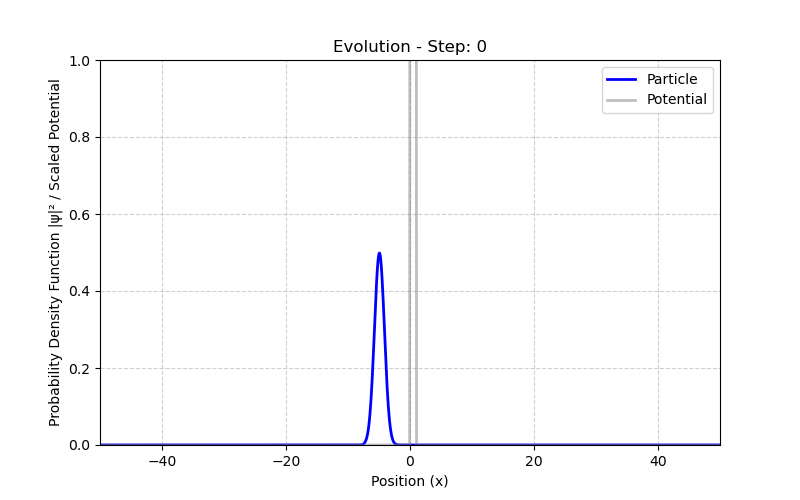
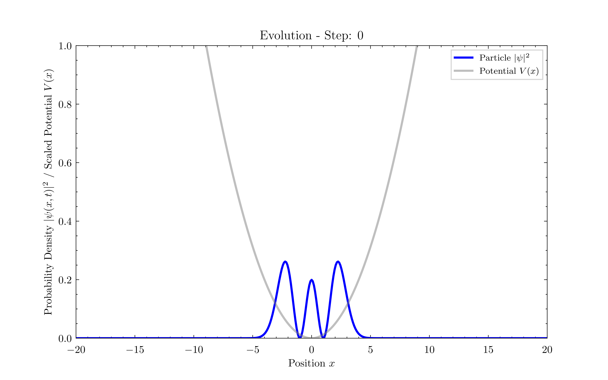
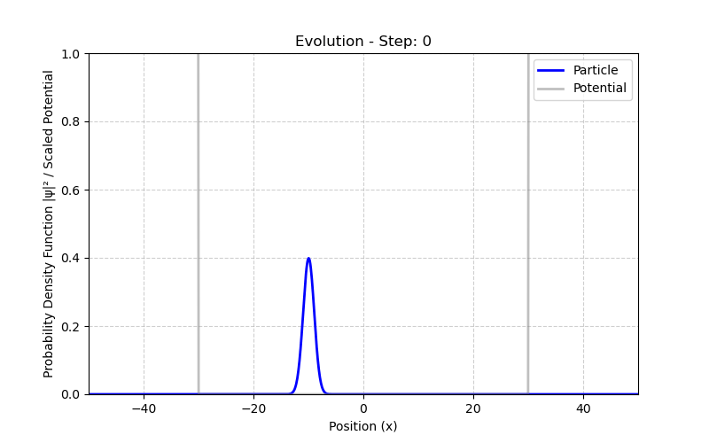

# 1DSchrodingerCUDA

A high-performance computational framework for simulating the one-dimensional Time-Dependent Schrödinger Equation (TDSE) using GPU acceleration. 

This project demonstrates that simulating quantum mechanics, prior to the act of measurement, is fundamentally an exercise in deterministic numerical analysis. The time evolution of a quantum state is a strictly unitary and deterministic mathematical process, which is computed here through low-level hardware interactions leveraging NVIDIA CUDA and the cuFFT library.

---

## Mathematical and Physical Foundations

The core objective of this engine is to numerically solve the Time-Dependent Schrödinger Equation:

$$i\hbar \frac{\partial \psi(x,t)}{\partial t} = \hat{H} \psi(x,t)$$


where the Hamiltonian operator $\hat{H}$ is defined as the sum of kinetic ($\hat{K}$) and potential ($\hat{V}$) energy operators:

$$\hat{H} = -\frac{\hbar^2}{2m}\frac{\partial^2}{\partial x^2} + V(x)$$


The formal solution for the time evolution of the wavefunction over a discrete time step $\Delta t$ is given by the time-evolution operator:

$$\psi(x, t+\Delta t) = \exp\left(-\frac{i}{\hbar} \hat{H} \Delta t\right) \psi(x,t)$$


### The Split-Operator Method and the Role of FFT

Because the operators $\hat{K}$ and $\hat{V}$ do not commute ($[\hat{K}, \hat{V}] \neq 0$), the exponential of their sum cannot be simply separated.[cite: 1] We employ the [Trotter-Suzuki approximation](https://www.researchgate.net/publication/388349534_Suzuki-Trotter_Decomposition_A_Step-by-Step_Theoretical_proof_of_the_formulae) (Split-Operator method) to bypass this limitation:

$$\exp\left(-\frac{i}{\hbar} (\hat{K} + \hat{V}) \Delta t\right) \approx \exp\left(-\frac{i}{2\hbar} \hat{V} \Delta t\right) \exp\left(-\frac{i}{\hbar} \hat{K} \Delta t\right) \exp\left(-\frac{i}{2\hbar} \hat{V} \Delta t\right) + \mathcal{O}(\Delta t^3)$$


This factorization is computationally highly advantageous because $\hat{V}$ is diagonal in position space, while $\hat{K}$ is diagonal in momentum space. 

In continuous analytical mathematics, evaluating the kinetic energy operator exponent, $\exp\left(-i \frac{\hat{p}^2}{2m\hbar} \Delta t\right)$, directly on a position-space wavefunction involves applying an exponential of a second-order differential operator ($\frac{\partial^2}{\partial x^2}$). This is generally intractable in closed form. However, transitioning from position space to momentum space diagonalizes the momentum operator. By utilizing a discrete grid, the Fast Fourier Transform (FFT) algorithm maps the spatial array to the frequency domain, where the differential operator transforms into a simple scalar multiplication. Consequently, the intractable continuous operator is reduced to a straightforward, element-wise vector multiplication of complex scalars, which **can be executed massively in parallel**.

The algorithm proceeds at each time step as follows:
1. Apply the half-step potential phase shift in position space: $\psi(x) \rightarrow \psi(x) \exp(-i V(x) \Delta t / 2\hbar)$
2. Transform the wavefunction to momentum space using a Fast Fourier Transform (FFT): $\phi(p) = \mathcal{F}\{\psi(x)\}$
3. Apply the full-step kinetic phase shift in momentum space: $\phi(p) \rightarrow \phi(p) \exp(-i p^2 \Delta t / 2m\hbar)$
4. Transform back to position space via Inverse FFT (IFFT): $\psi(x) = \mathcal{F}^{-1}\{\phi(p)\}$
5. Apply the final half-step potential phase shift.

By offloading the highly parallelizable element-wise vector multiplications and the FFT computations to the GPU via CUDA kernels and cuFFT, the simulation achieves massive speedups compared to standard CPU implementations.[cite: 1]
> **Note on Boundary Conditions:** Because this numerical solver relies heavily on the Fast Fourier Transform (FFT), the spatial domain is inherently periodic. If a wavepacket travels beyond the right edge of the spatial grid, it will immediately "wrap around" and re-enter from the left edge. To avoid these unphysical wrapping artifacts during scattering experiments, the domain size (`L` in the JSON configuration) must be kept sufficiently large to contain the wavepacket for the entire duration of the simulation, rationally picked by taking into account the initialized $\sigma$ value (`"sigma"` in the .json format).
---

## Physical Scenarios and Expected Results

The robust numerical solver described above allows for the observation of complex, non-classical phenomena simply by altering the static potential landscape $V(x)$ and the initial state $\psi(x,0)$. 

### 1. Quantum Tunneling (`tunneling.json`)
A Gaussian wavepacket is projected toward a finite potential barrier. Classically, if the particle's kinetic energy is strictly less than the barrier height, complete reflection must occur. However, solving the TDSE reveals quantum tunneling: upon impact, the wavepacket splits. While the majority of the probability amplitude reflects and generates severe interference fringes with the incoming tail, a non-zero probability density exponentially decays through the barrier and emerges on the transmission side, propagating freely.

<p align="center">
  <!-- [INSERT TUNNELING GIF HERE] -->
  
</p>

### 2. Quantum Harmonic Oscillator (`oscillator.json`)
This setup simulates a particle subject to a parabolic potential $V(x) = \frac{1}{2}m\omega^2 x^2$. If the system is initialized with an energy eigenstate (e.g., the ground state or a higher stationary state) like in the image below where is initialized as the second excited state, the probability density $\vert{}\psi(x,t)\vert{}^2$ remains perfectly static over time, demonstrating the concept of stationary states. If initialized as a displaced coherent state (the ground state shifted away from the origin), the entire Gaussian wavepacket oscillates harmonically back and forth indefinitely without spatial dispersion, recovering the classical limit of a pendulum.

<p align="center">
  <!-- [INSERT OSCILLATOR GIF HERE] -->
  
</p>

> **Note on the static animation:** If you configure the simulation to run a pure energy eigenstate, the resulting GIF will appear completely static. This is not a rendering bug, but a direct visualization of a quantum stationary state. While the unobservable complex phase rotates continuously in time, the observable probability density remains mathematically invariant. To observe a dynamic, oscillating coherent state, simply offset the initial position by modifying the `x0` parameter (e.g., `"x0": -5.0`) in the JSON configuration.

### 3. Finite Quantum Well (`quantum_well.json`)
A free wavepacket enters a region characterized by a finite, negative potential step (a well). As the particle enters the well, it accelerates (wavelength decreases). Upon hitting the potential boundaries of the well, partial reflection and transmission occur. The simulation visually captures the dynamic trapping of a portion of the wavepacket, which subsequently bounces back and forth within the well, exhibiting rapid and intricate internal quantum interference.

<p align="center">
  <!-- [INSERT QUANTUM WELL GIF HERE] -->
  
</p>

---

## Architectural Design Choices

To ensure scalability and maintainability, the project separates the physical setup from the computational engine.

*   **The Configurator (JSON):** Physical parameters (domain size, mass, wavepacket momentum, potential barrier height) are defined in human-readable JSON files.
*   **The Bridge (Python):** A setup script parses the JSON, computes the initial complex wavefunction $\psi(x, 0)$ and the potential vector $V(x)$ using NumPy, and serializes them into raw data files.
*   **The Engine (CUDA/C++):** The compiled binary is entirely agnostic to the physical scenario.[cite: 1] It blindly reads the serialized arrays, allocates device memory, executes the Trotter-Suzuki loop on the GPU, and outputs the resulting probability density states at requested intervals.
*   **The Renderer (Python):** A final script reads the output matrices and utilizes Matplotlib to generate an animated GIF of the quantum evolution.

### Directory Structure

```text
.
├── Makefile                # Automation for builds, execution, and rendering
├── README.md               # Project documentation
├── scripts/                
│   ├── physics_setup.py   # Python script translating JSON into raw input data
│   └── animate.py          # Python script for rendering the output GIF
├── src/                    
│   └── schrodinger.cu      # CUDA C++ source code (The computational engine)
├── experiments/            
│   ├── quantum_well.json   # Configuration for a finite quantum well (particle trapping and scattering)
│   ├── free_particle.json  # Configuration for free space propagation
│   ├── tunneling.json      # Configuration for quantum tunneling through a barrier
│   └── oscillator.json     # Configuration for the quantum harmonic oscillator
└── data/                   
    ├── input/              # Auto-generated initial conditions (.gitignore)
    └── output/             # Auto-generated simulation results (.gitignore)
```

---

## Portability and Compilation Environment

Compiling CUDA code natively often requires polluting the host machine with specific NVIDIA toolkits, GCC versions, and libraries that frequently conflict with modern or cutting-edge Linux distributions.

To bypass this, the build system leverages **Podman** (a daemonless, rootless container engine).
The `Makefile` mounts the current working directory into an official `nvidia/cuda` container, compiles the source code using `nvcc`, and returns the executable to the host OS.

The build command utilized is:
`podman run --rm --userns=keep-id -v "$(CURDIR)":/app:Z -w /app nvidia/cuda:12.3.2-devel-ubuntu22.04 nvcc`

**Key implementation details for portability:**

* `--userns=keep-id`: Ensures the compiled binary retains the permissions of the host user, preventing the creation of unmodifiable root-owned files on the host system.
* `-v "$(CURDIR)":/app:Z`: Mounts the repository securely, with the `:Z` flag automatically handling SELinux labeling contexts, which is crucial for systems like Fedora or RHEL.
* Since the compilation occurs inside the container but the execution occurs on the host, the host system only requires the standard NVIDIA proprietary drivers, completely eliminating the need for a local CUDA Toolkit installation.

---

## Build and Execution

The entire workflow is automated via GNU Make.

### 1. Run a Simulation

To compile the CUDA engine (if not already compiled), generate the input data for a specific scenario, and run the hardware-accelerated simulation, use the `build` target and pass the experiment name via the `EXP` variable:

```bash
make build EXP=tunneling

```

*Available default experiments: `tunneling`, `oscillator`, `quantum_well`.*

### 2. Generate the Animation

Once the simulation has finished and the data is populated in `data/output/`, generate the visual representation:

```bash
make animate

```

This will produce a `wavepacket.gif` file in the root directory.

### 3. Clean the Environment

Before running a second simulation, in order to purge the compiled binary, wipe all generated input/output data arrays, and remove existing GIFs:

```bash
make clean

```

